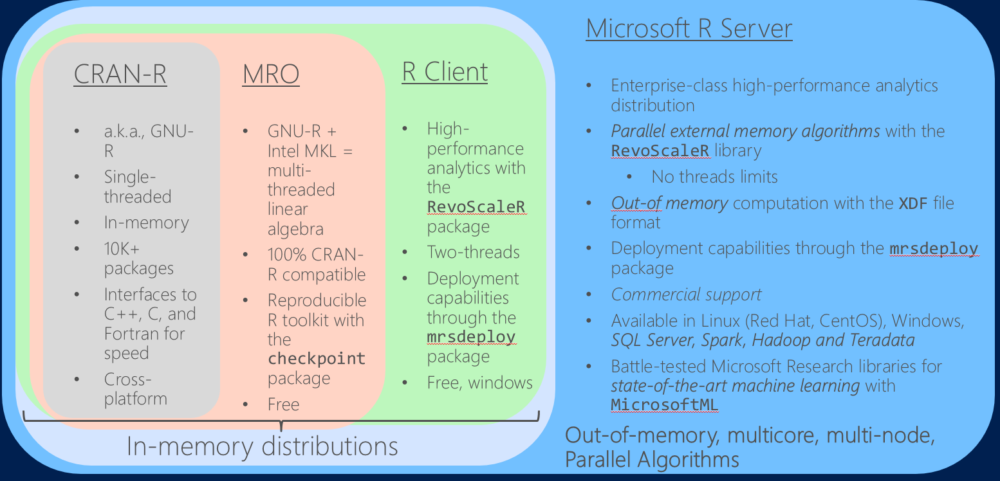

```{r global_options, include=FALSE}
knitr::opts_chunk$set(warning=FALSE, message=FALSE, fig.align = 'center')
```

# Course Logistics

## Day One

### R U Ready?

* Overview of The R Project for Statistical Computing
* The Microsoft R Family
* R's capabilities and it's limitations
* What types of problems R might be useful for
* How to manage data with the exceptionally popular open source package `dplyr`

### Scalable Data Analysis with Microsoft R

* Breaking the Memory Barrier with XDFs
* Using the `dplyrXdf` Package to Manipulate Data
* Performance Considerations with the `RevoScaleR` Package
* Modeling and Scoring with `RevoScaleR`

## Day Two

### Spark on HDInsight, An Overview

* Overview of the Apache Spark Project
* Taming the Hadoop Zoo with HDInsight
* Using the AzureSMR package to Programmatically Deploy HDInsight Clusters
* Spark Fundamentals - Functional Programming, Scala and the Collections API
* Spark SQL/DataFrames - Relational Data Processing with Spark and sparklyr
* Sharing Metastore and Storage Accounts with Hadoop/Hive Clusters and Spark Clusters

### Joins and UDFs with Spark

* Optimizing Joins in Spark SQL
* Caching Spark DataFrames, Saving to Parquet
* Understanding Spark Internals and Job Execution for Performance Optimizations
* Monitoring Spark Applications with SparkUI and Logs
*Developing Machine Learning Pipelines with Spark ML

## Day Three

### R Server on Spark

* Microsoft R Compute Contexts
* How PEMA Algorithms Actually Work and Interface with Different Platforms
* Manipulating Hive, Parquet and XDFD Data Sources with Microsoft R Server
* Training R Server Algorithms in Spark
* Validating Machine Learning Algorithms in Microsoft R Server
* Operationalizing Microsoft R Server Algorithms with mrsdeploy


## Prerequisites
### Computing Environments

* R Server 8.0.5 or above (most recent version is 9.0.2)
* Azure Credits
* Can use the [Linux DSVM](https://azure.microsoft.com/en-us/documentation/articles/machine-learning-data-science-linux-dsvm-intro/)
* Or the [Windows DSVM](https://azure.microsoft.com/en-us/documentation/articles/machine-learning-data-science-provision-vm/)
* For IDE: choises are [RTVS](https://www.visualstudio.com/vs/rtvs/), [RStudio Server](https://www.rstudio.com/products/rstudio/download3/), [JupyterHub](https://jupyterhub.readthedocs.io/en/latest/), [JupyterLab](http://jupyterlab-tutorial.readthedocs.io/en/latest/)... 
    + Whatever you're comfortable with!

## Development Environments 
### Where to Write R Code

* The most popular integrated development environment for R is [RStudio](https://www.rstudio.com/)
* The RStudio IDE is entirely html/javascript based, so completely cross-platform
* RStudio Server provides a full IDE in your browser: perfect for cloud instances
* For Windows machines, 2016 provided general availability of [R Tools for Visual Studio, RTVS](https://www.visualstudio.com/en-us/features/rtvs-vs.aspx)
* RTVS supports connectivity to Azure and SQL Server for remote connectivity


## What is R? 
### Why should I care?

* R is the successor to the S Language, originated at Bell Labs AT&T
* It is based on the Scheme interpreter
* Originally designed by two University of Auckland Professors for their introductory statistics course


## R's Philosophy 
### What R Thou?

R follows the [Unix philosophy](http://en.wikipedia.org/wiki/Unix_philosophy)

* Write programs that do one thing and do it well (modularity)
* Write programs that work together (cohesiveness)
* R is extensible with more than 10,000 packages available at CRAN (http://crantastic.org/packages)


## The aRt of Being Lazy
### Lazy Evaluation in R


* R, like it's inspiration, Scheme, is a _functional_ programming language
* R evaluates lazily, delaying evaluation until necessary, which can make it very flexible
* R is a highly interpreted dynamically typed language, allowing you to mutate variables and analyze datasets quickly, but is significantly slower than low-level, statically typed languages like C or Java
* R has a high memory footprint, and can easily lead to crashes if you aren't careful

## R's Programming Paradigm
### Keys to R

<span class="fragment">Everything that exist in R is an *object*</span>
<br>
<span class="fragment">Everything that happens in R is a *function call*</span>
<br>
<span class="fragment">R was born to *interface*</span>
<br>

<span class="fragment">_—John Chambers_</span>

## Strengths of R 
### Where R Succeeds

* Expressive
* Open source 
* Extendable -- nearly 10,000 packages with functions to use, and that list continues to grow
* Focused on statistics and machine learning -- cutting-edge algorithms and powerful data manipulation packages
* Advanced data structures and graphical capabilities
* Large user community, both within academia and industry
* It is designed by statisticians 


## Weaknesses of R 
### Where R Falls Short

* It is designed by statisticians
* Inefficient at element-by-element computations
* May make large demands on system resources, namely memory
* Data capacity limited by memory
* Single-threaded

## Distributions of R



## Some Essential Open Source Packages

* There are over 10,000 R packages to choose from, what do I start with?
* Data Management: `dplyr`, `tidyr`, `data.table`
* Visualization: `ggplot2`, `ggvis`, `htmlwidgets`, `shiny`
* Data Importing: `haven`, `RODBC`, `readr`, `foreign`
* Other favorites: `magrittr`, `rmarkdown`, `caret`

# R Foundations

## Command line prompts

Symbol | Meaning
------ | -------
 `<-`   | assignment operator
  `>`   | ready for a new command
  `+`   | awaiting the completion of an existing command 
  `?`   | get help for following function
  
Can change options either permanently at startup (see `?Startup`) or manually at each session with the `options` function, `options(repos = " ")` for example.

Check your CRAN mirror with `getOption("repos")`.

## I'm Lost! 
### Getting Help for R

* [Stack Overflow](http://stackoverflow.com/questions/tagged/r)
* [R Reference Card](https://cran.r-project.org/doc/contrib/Short-refcard.pdf)
* [RStudio Cheat Sheets](https://www.rstudio.com/resources/cheatsheets/)
* [R help mailing list and archives](https://stat.ethz.ch/mailman/listinfo/r-help)
* [Revolutions Blog](http://blog.revolutionanalytics.com/)
* [R-Bloggers](http://www.r-bloggers.com/)
* [RSeek](rseek.org)
* [RDocumentation](https://www.rdocumentation.org/)
